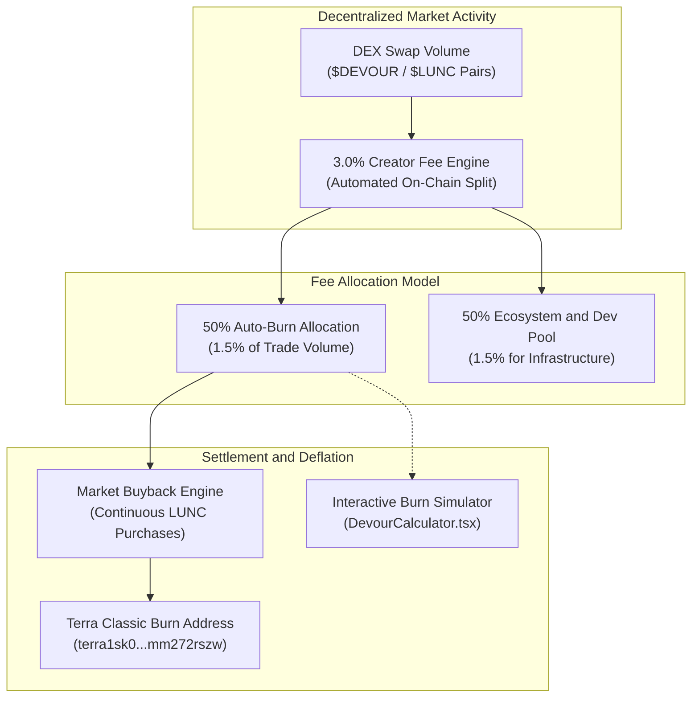

# 🔥 LUNC Devourer ($DEVOUR) — Web3 dApp Showcase & Fee Burn Simulator

[](LICENSE)
[-black?logo=next.js)](https://nextjs.org/)
[](https://react.dev/)
[](https://tailwindcss.com/)
[-002B49)](https://classic-docs.terra.money/)

> ⚠️ **Project Status & Historical Disclosure**:  
> The `$DEVOUR` token was originally conceived for deployment on **Terraport LaunchPump**. Due to the permanent shutdown of LaunchPump, the token was never deployed on-chain and live trading was never initiated. This repository is preserved and open-sourced strictly as an **interactive Web3 product showcase, community interface design, and mathematical tokenomics burn simulator**.

---

## 🏛️ Overview & Concept

**LUNC Devourer** was designed as an automated deflationary mechanism for the Terra Classic ($LUNC) ecosystem. The core thesis centered on converting transaction fees into perpetual burn volume:

1. **3% Creator Swap Fee:** Collected on DEX trades.
2. **50% Auto-Burn Allocation:** Half of the fee (1.5% of total volume) is allocated to automated market buybacks and sent directly to Terra Classic's official burn address (`terra1sk06e308967wka9ww2c295x2r48705tyxmm272rszw`).
3. **50% Ecosystem & Dev Allocation:** Half of the fee (1.5%) allocated to continuous development and community incentives.

---

## 🏛️ Tokenomics & Burn Architecture



---

## ✨ Features

- **Interactive Fee & Burn Simulator (`DevourCalculator.tsx`):** Real-time mathematical projection tool modeling daily, monthly, and yearly LUNC burn quantities based on adjustable daily volume and LUNC market price.
- **Dynamic Ember Particle Canvas (`EmberParticlesCanvas.tsx`):** Custom GPU-accelerated HTML5 Canvas particle animation rendering an ambient flame and ember atmosphere.
- **Transparent On-Chain Burn Explorer (`LiveBurnExplorer.tsx`):** Verification module linked to official Terra Finder explorer addresses.
- **Responsive Web3 UI Components:** Complete suite of modular design patterns (Roadmap, Tokenomics, HowToBuy, Navigation, Hero).

---

## 🛠️ Tech Stack

- **Framework:** Next.js 16 (App Router with Turbopack)
- **UI Library:** React 19, Lucide React
- **Animations:** Framer Motion, Canvas Confetti
- **Styling:** Tailwind CSS + custom glassmorphic CSS variables
- **Language:** TypeScript 5

---

## 🚀 Local Development

### Prerequisites
- Node.js 20+ (recommended Node 22)
- npm or pnpm

### Installation

```bash
# Clone the repository
git clone https://github.com/Lukecele/lunc-devourer.git
cd lunc-devourer

# Install dependencies
npm install

# Start local development server
npm run dev
```

Open [http://localhost:3000](http://localhost:3000) in your browser.

### Production Build

```bash
npm run build
npm run start
```

---

## 📜 License

Distributed under the [MIT License](./LICENSE). Open-source design and code for Web3 developers and community builders.
